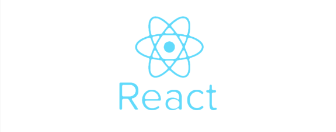

<p align="center">
  
</p>
<!-- 
#   -->


## Table of contents

- [Motivations](#motivations)
- [Screenshots](#screenshots)
- [Technologies](#technologies)
- [Setup](#setup)
- [Features](#features)
- [Status](#status)
- [Inspiration](#inspiration)
- [Contact](#contact)


## Motivations
The global pandemic has completely solidified the need for e-commerce. Where it used to be just one of many options we had when it came to making a purchase, e-commerce instead became the primary method of shopping. With all non-essential shops closed across the world for large swathes of 2020 and 2021, and an increasing number of us concerned about social distancing, shopping online became the norm and we saw dramatic e-commerce sales growth. 

 With experience in maintaining merchants' e-commerce stores, it felt natural to take the next step and develop an independent functioning e-commerce app.  Not only does this expand knowledge and experience in developing applications executing the MERN stack, but also gives a better understanding of maintaining apps that have already been established.  

This is an eCommerce platform built with the MERN stack, Redux and GraphQL.

## Screenshots

<p align="center">Front Page</p>


<p align="center">Shop Page</p>


## Technologies


### Architecture


### Libraries and tools

[](https://nodejs.org/en/) [](https://www.npmjs.com/package/express)

[](https://www.npmjs.com/package/bootstrap) [](https://www.npmjs.com/package/apollo-server-express)

[](http://wwww.mongodb.com/) [](https://www.npmjs.com/package/graphql)

[](https://www.npmjs.com/package/styled-components) [](https://www.npmjs.com/package/react)

[](https://www.npmjs.com/package/react-scripts) [](https://www.npmjs.com/package/react-bootstrap)

[](https://www.npmjs.com/package/react-router-dom) [](https://www.npmjs.com/package/stripe)

[](https://www.heroku.com) [](https://www.npmjs.com/package/jsonwebtoken)

[](https://www.npmjs.com/package/mongoose)


### GraphQL

GraphQL is a query language for APIs and a runtime for fulfilling queries with existing data. In our application, we used it as an API to fetch data from our MongoDB database.


## Setup

```
npm install
npm run launch
```

In order to run GraphQL API to fetch data in [api directory](/api/v2/grapql-server/), run:

```
npm install
npm start
```

### Building


```
npm run build
```

Authentication using JSON Web Tokens (JWT).
Option to add, edit, view and delete all the items in our store.
Option to add items or remove items from the cart for the user.
Display the total bill of the cart and update it as soon as the cart is updated by the user.
Using Local Storage to store the JWT so that we only allow logged-in users to buy items.
Option to pay using Stripe Checkout and thus creating a new order and emptying the cart after payment is successful.


## Features


Considerations for improvement: 


## Landing Page and Deployment


Project is deployed on Heroku!

[Felicity]()

## Inspiration


## Contact

Created by: 
Alina Zaidi https://github.com/az84 <br>
Lucas DiFalco https://github.com/ldifalco
