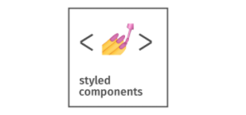
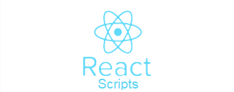

  

## Table of contents

- [Motivations](#motivations)
- [Screenshots](#screenshots)
- [Tools and Technologies](#toolsAndTechnologies)
- [Setup](#setup)
- [Functionality](#functionality)
- [Features](#features)
- [Contact](#contact)

## Motivations

The global pandemic has completely solidified the need for e-commerce. Where it used to be just one of many options we had when it came to making a purchase, e-commerce instead became the primary method of shopping. With all non-essential shops closed across the world for large swathes of 2020 and 2021, and an increasing number of us concerned about social distancing, shopping online became the norm and we saw dramatic e-commerce sales growth. 

With experience in maintaining merchants' e-commerce stores, it felt natural to take the next step and develop an independent functioning e-commerce app.  Not only does this expand knowledge and experience in developing applications executing the MERN stack, but also gives a better understanding of maintaining apps that have already been established.  

This is an eCommerce platform built with the MERN stack, Redux and GraphQL.

## Deployment

Link to our website hosted on Heroku: [Felicity](https://felicityecommerce.herokuapp.com/)

## Screenshots

Front Page

Shopping and Login/Create Account Pages

Stripe Checkout

Customers will have the ability to create an account through a signup form found on the `Navigation Bar` whereupon users can add items to their cart if so desired. Utilization of the `Navigation Bar` or homepage buttons will help customers select shopping items for purchase. Once items are stored in the cart, customers will be able to checkout via Stripe before being redirected back to the website.

## Architecture

## Tools and Technology

 

 

 

 

 

 

 

### GraphQL

GraphQL is a query language for APIs and a runtime for fulfilling queries with existing data. In our application, we used it as an API to fetch data from our MongoDB database.

## Setup

Download a copy of this repo to a directory of your choice. To install, you will need to run `npm i` or `npm install` to get all the dependencies running. Following proper installation of the dependencies, you will type `npm start` on the root directory terminal to start the server.

To stop the server you will need to use the existing terminal to execute `CTRL+C` followed by `Y` for confirmation to terminate the connection to localhost.

Please see documentation on your own host's server commands should you run this on a live instance rather than locally.

## Usage

Be sure all repository files were successfully cloned to server and a connection to the database is complete. You will also need to signup for a free account at [mongodb.com](https://www.mongodb.com/). 

## Functionality

- Uses React for the front end.
- Uses GraphQL with a Node.js and Express.js server.
- Uses MongoDB and the Mongoose ODM for the database.
- Uses queries and mutations for retrieving, adding, updating, and deleting data.
- Deployed using Heroku (with data).
- Meets the minimum requirements of a PWA: Uses a web manifest, Uses a service worker for offline functionality.
- Offers a polished UI, is responsive and is interactive 
- Includes authentication (JWT) and protects sensitive API key information on the server.

## Features

- Authentication using JSON Web Tokens (JWT).
- Option to add, view or remove items from the cart for the user.
- Displays the total cost and update it as soon as more items are added by the user.
- Payments are handled via external Stripe API, thus creating a new order and emptying the cart after payment is successful.
- Cart data persists throughout browser sessions using localStorage.

Considerations for improvement: 

- Expand inventory models with options for stock quantity, size.
- Better pop-up messages for error handling.
- Allow the buyer/users to signup, login and reset password, search for products, save and edit shopping carts and complete orders online.
- Send users confirmation emails about their orders and provide them customer support all in one place.
- Build an admin dashboard and sales report chart so that it is easier for the seller to manage their inventories and orders .
- Enable buyer to choose address on the google map.
- Allow the sellers to send buyer notifications about the orders.
- Provide online customer support such as chat with admin/seller.

## Contact

Created by: 
- [Alina Zaidi](https://github.com/az84)
- [Lucas DiFalco](https://github.com/ldifalco)
